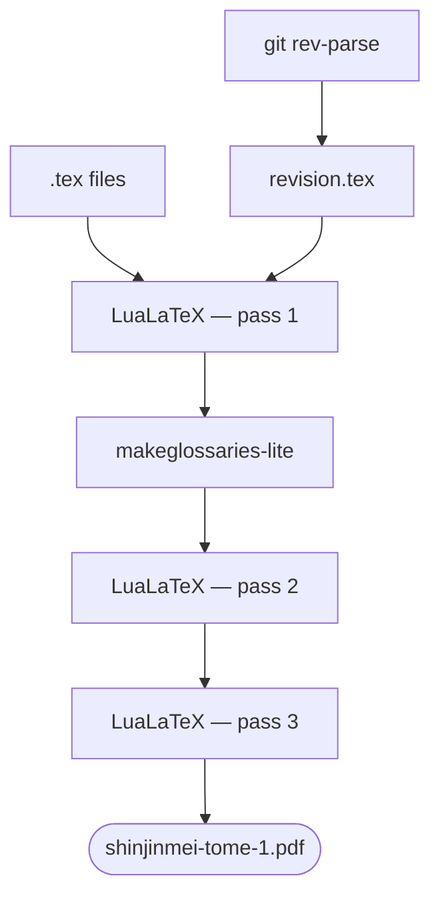

## From a Voice to a Bookshelf

How do you turn twenty years of a teacher's spoken words into books — without a publishing house, without a budget, and without losing the voice that made them worth keeping?

That was the question behind a **three-volume edition of recorded talks**, delivered between 2002 and 2024 and captured, session after session, over two decades. The teacher passed in 2025. The recordings, the transcriptions, and the will to publish them remained.

What followed was not a traditional book project. It was a **software project that happens to produce books** — plain-text sources under Git, a build system, automated quality checks, and AI woven into the loop. In thirteen days and 167 commits, the work moved from raw LaTeX to camera-ready volumes in three formats and two languages.

This is how it was built, and what the approach is good for.

---

## Treat the book like a repository

The instinct, when you have a stack of Word transcriptions, is to open a word processor and start formatting. That path leads where it always leads: a brittle file nobody else can rebuild, layout tangled into content, and no way to ask *what changed between this version and the last one?*

So the project did the opposite. The book became a **docs-as-code repository** — exactly the discipline I keep coming back to for documentation, now pointed at a printed object. The principle is the same one behind [storing content in plain files rather than a database](https://redaction-technique.org/blog/manage-content-in-files-not-databases): if your source is text, your history is legible, your collaboration is sane, and your build is reproducible.

The flow is linear and auditable:

> **The pipeline**
>
> Spoken talk → audio recording → Word transcription → LaTeX → print
>
> A parallel branch exports Markdown → the web. A third denoises the audio for streaming. QR codes stitch the three back together.

Every physical copy carries the **Git commit hash** in its colophon. That single detail captures the whole philosophy: a book you can trace back to an exact source revision is a book that was *engineered*, not just typeset.

---

## One source, many books

The point of a structured source is never the source itself — it's what you can do with it without touching it again. The same LaTeX corpus drives every deliverable through a `make` target. Nothing is hand-assembled.

| Build target | Output | Audience |
| --- | --- | --- |
| `make tome1 / tome2 / tome3` | A5 print PDF per volume | Readers buying individual volumes |
| `make whole` | Single-volume A5 PDF | Readers wanting the complete work |
| `make a4` | A4 two-column layout | Screen reading, institutional copies |
| `make hirondelle-tome1` | Print PDF with crop/bleed marks | The printer |
| `make sample` | 4-page preview | Stakeholder review before a full run |
| `make es-tome1` | Spanish Volume I | Spanish-speaking readers |
| `make md-tome1` | Markdown export | The web edition |

This is **separation of content and presentation** taken to its conclusion. The text, the dates, the cross-references live once; the format is a render target, not a copy. It's the same argument I made for [a YAML single source of truth](https://redaction-technique.org/blog/scalable-maintainable-technical-docs-with-yaml) — only here the outputs are a perfect-bound book and a screen layout instead of a table and an API.

Each `make` target drives the same compilation sequence: inject the Git commit hash, run LuaLaTeX three times, resolve the glossary in between.

> **Note:** the A4 two-column edition is the quiet winner of this list. It costs nothing extra to produce — it's just another target — yet it's ideal for institutional use. An asset you get for free is an asset worth promoting.

---

## AI in the loop, not on top

It would be easy to bolt AI onto a pipeline as an afterthought — a spellcheck here, a summary there. This project did something more deliberate: **AI is structurally embedded, and documented openly** inside the book itself, model names and all, in a "how this book was made" section. Transparency isn't a footnote; it's part of the design.

Two models, two jobs:

- **Mistral Large 3** handles the repetitive, structural work — glossary generation, index tagging and merging, cross-chapter consistency checks, chapter-difficulty classification, ornament placement, even a pass that flags AI-generated phrasing.
- **Claude Sonnet 4.6** handles the open-ended work — generating and fixing LaTeX, solving typographic problems, and assisting the Spanish translation.

The pipeline that produces those `.tex` sources runs ten steps in sequence, six of them calling Mistral:

What makes it a *loop* rather than a one-shot is direction. AI output feeds back into the LaTeX sources, which can then be re-checked against the next pass — **a continuous quality cycle, not a single verdict**. The machine drafts and flags; the human decides and commits. This is the same instinct behind an [AI-assisted workflow for translating legacy content](https://redaction-technique.org/blog/ai-translation-legacy-technical-docs): let automation carry the volume, and reserve judgment for the parts that need it.

---

## The part that stayed slow: typography

Automation freed up time. It did not replace taste. Typography drew the most iteration of the whole sprint — twenty commits on type parameters alone, and more on colour and spacing.

The body font was tested against Libertinus, Crimson Pro, Cardo, and Gentium Plus — and then **reverted, every time, to EB Garamond**. The body size came down from 11pt to 10pt. Headers run in italic small caps at 40% grey; ornaments sit at 70% black, QR codes at 60%, structural marks at 60% — a restrained grayscale calibrated by eye. Drop caps, tabular lining figures, widow and orphan control, a 5mm binding gutter, optical centering, non-breaking long-form dates like "Vendredi 2 août 2002."

None of that is glamorous. All of it is the difference between a PDF and a book.

> **Tip:** when a tool makes the mechanical work cheap, spend the time you save on the judgment work — the kerning, the grey values, the page that simply *feels* settled. Cheap iteration is only an advantage if you reinvest it in craft.

---

## A bridge between the page and the voice

The most affecting design decision is also the simplest. Every chapter carries a **QR code linking to the original recording** — dozens of talks migrated off an aging podcast host and onto a stable channel. A reader following the printed transcription can, in one scan, hear the teacher's actual voice saying the same words.

That is the whole project in one gesture: the book is not a replacement for the talks, it's **an index into them**. Print and digital stop competing and start reinforcing each other — text you can study, voice you can return to. It's the same bridge between archive and living attention I wrote about in [turning a corpus into living knowledge](https://redaction-technique.org/blog/transforming-corpus-ai-living-knowledge), here made literal with a square of black and white ink.

---

## An economy that matches the work

Commercial publishing would have been the wrong fit. The project runs on a **community-supported model**: published by a non-profit association for its members, sources open on GitHub, funded by roughly fifty named supporters across three tiers. The model isn't a workaround for a missing budget; it's an expression of how the community already works.

Open sources reinforce it. Anyone can rebuild the book from the repository, and the commit hash in each copy ties the artifact to the exact text that produced it. The result is a publication that is both **freely inspectable and physically trustworthy** — an unusual pairing that the docs-as-code approach makes ordinary.

---

## What I'd tell the next team

A few observations from inside the sprint, for anyone building books this way:

1. **Register the ISBN early.** Robust Git traceability is no substitute for a legal-deposit entry. Do it before the first print run, not after.
2. **Give humans a version number too.** A commit hash is perfect for machines and useless to a reader. Print a visible "Édition 1.0" alongside it.
3. **Decouple audio from its host.** A migration trail from one platform to another to a third is a warning. A stable identifier, independent of any host, would outlast them all.
4. **Release in phases.** Volume I is polished; II and III are built but less finished. A staged release maps cleanly onto a community-funded model — and onto how readers actually arrive.

---

## The point was never the pipeline

It's tempting to tell this story as a feat of tooling — the build targets, the two models, the 167 commits in thirteen days. But the tooling was always in service of something plainer.

A teacher spoke for twenty years. People recorded it, transcribed it, and wanted others to be able to read it, hold it, and hear it. **Docs-as-code didn't make the talks; it kept them legible, reproducible, and alive** — one source, many books, a voice you can still scan your way back to.

Automation, used well, isn't a substitute for attention. It's an instrument for it.

---

## TL;DR

- **Treat the book as a repository:** plain-text LaTeX sources, Git history, a `make`-driven build, the commit hash printed in every copy.
- **One source, many outputs:** A5 print, A4 two-column, web Markdown, and a Spanish edition all render from the same corpus — content separated from presentation.
- **AI in a loop, not on top:** Mistral for structural and consistency work, Claude for LaTeX and translation, output fed back into the sources and re-checked.
- **Keep the craft slow:** automation buys time; spend it on typography and judgment.
- **Bridge print and voice:** a QR code in every chapter links the transcription to the original recording.

---

**Reference:** this case study draws on a real multi-volume production built with an open-source LaTeX pipeline. For the underlying principles, see [strong information typing without the XML overhead](https://redaction-technique.org/blog/strong-information-typing-without-xml-overhead) and [managing content in files, not databases](https://redaction-technique.org/blog/manage-content-in-files-not-databases).
