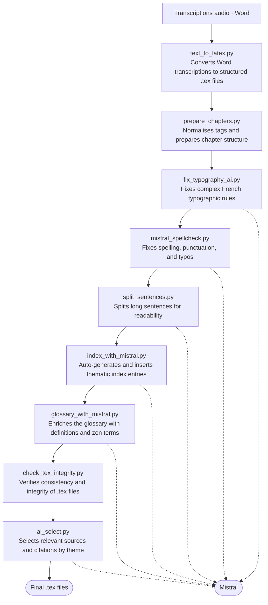

## From a Voice to a Bookshelf

How do you turn twenty years of a teacher's spoken words into books — without a publishing house, without a budget, and without losing the voice that made them worth keeping?

That was the question behind a **three-volume edition of recorded talks**, delivered between 2002 and 2024 and captured, session after session, over two decades. The teacher was Stéphane Kōsen Thibaut (1950–2025): a French Sōtō Zen monk, dharma heir of Taisen Deshimaru, and one of the people most responsible for rooting that lineage in Europe and Latin America — founder of the first Sōtō temple in South America, in Argentina, and of Yūjō Nyūsanji in France. His teachings were weekly dharma talks, given at dojos across Europe, on Zen practice and classical texts. He passed in September 2025. The recordings, the transcriptions, and the will to publish them remained.

What followed was not a traditional book project. It was a **software project that happens to produce books** — plain-text sources under Git, a build system, automated quality checks, and AI woven into the loop. In thirteen days and 167 commits, the work moved from raw LaTeX to camera-ready volumes in three formats and two languages.

This is how it was built, and what the approach is good for.

---

## Treat the book like a repository

The instinct, when you have a stack of Word transcriptions, is to open a word processor and start formatting. That path leads where it always leads: a brittle file nobody else can rebuild, layout tangled into content, and no way to ask *what changed between this version and the last one?*

So the project did the opposite. The book became a **docs-as-code repository** — exactly the discipline I keep coming back to for documentation, now pointed at a printed object. The principle is the same one behind [storing content in plain files rather than a database](https://redaction-technique.org/blog/manage-content-in-files-not-databases): if your source is text, your history is legible, your collaboration is sane, and your build is reproducible.

The flow is linear and auditable:

> **The pipeline**
>
> Spoken talk → audio recording → Word transcription → LaTeX → print
>
> A parallel branch exports Markdown → the web. A third denoises the audio for streaming. QR codes stitch the three back together.

Every physical copy carries the **Git commit hash** in its colophon. Check out that revision and the volume in your hands rebuilds, byte for byte, from the same source.

---

## Traceability down to the machine

The colophon goes further than the commit hash. It also records the machine the PDF was built on — hostname, operating system, and LuaTeX version — so the full build environment is part of the artifact. A reader holding the book can establish not just *what source produced it* but *where and how it was compiled*.

This matters more than it sounds. Subtle rendering differences between LaTeX versions, font renderers, or OS-level libraries can affect line breaks, hyphenation, and spacing in ways that shift page counts and reflowing. The machine record closes that gap: if the output ever looks different, you know whether the source changed, the environment changed, or both.

---

## One source, many books

The point of a structured source is never the source itself — it's what you can do with it without touching it again. The same LaTeX corpus drives every deliverable through a `make` target. Nothing is hand-assembled.

| Build target | Output | Audience |
| --- | --- | --- |
| `make tome1 / tome2 / tome3` | A5 print PDF per volume | Readers buying individual volumes |
| `make whole` | Single-volume A5 PDF | Readers wanting the complete work |
| `make hirondelle-tome1` | Print PDF with crop/bleed marks | The printer |
| `make sample` | 4-page preview | Stakeholder review before a full run |
| `make es-tome1` | Spanish Volume I | Spanish-speaking readers |
| `make md-tome1` | Markdown export | The web edition |

This is **separation of content and presentation** taken to its conclusion. The text, the dates, the cross-references live once; the format is a render target, not a copy — the same principle behind [a YAML single source of truth](https://redaction-technique.org/blog/scalable-maintainable-technical-docs-with-yaml), only here the outputs are a perfect-bound book and a screen layout instead of a table and an API.

Each `make` target drives the same compilation sequence: inject the Git commit hash, run LuaLaTeX three times, resolve the glossary in between.

---

## AI in the loop, not on top

It would be easy to bolt AI onto a pipeline as an afterthought — a spellcheck here, a summary there. This project did something more deliberate: **AI is structurally embedded, and documented openly** inside the book itself, model names and all, in a "how this book was made" section. Transparency isn't a footnote; it's part of the design.

Two models, two jobs:

- **Mistral Large 3** handles the repetitive, structural work — glossary generation, index tagging and merging, cross-chapter consistency checks, chapter-difficulty classification, ornament placement, even a pass that flags AI-generated phrasing.
- **Claude Sonnet 4.6** handles the open-ended work — generating and fixing LaTeX, solving typographic problems, and assisting the Spanish translation.

The pipeline that produces those `.tex` sources runs nine steps in sequence, six of them calling Mistral:

Not every step held up. The sentence-splitting pass (`split_sentences.py`) was the clearest failure: Mistral cut long sentences at grammatically valid but rhythmically wrong points, producing choppy fragments that lost the teacher's spoken cadence — the quality the project existed to preserve. The output had to be reviewed and rewritten by hand, which took longer than leaving the original sentences alone would have. That step earns its place in the diagram but not in the success column.

Claude's LaTeX output had a different failure mode: it frequently didn't compile. A one-shot workflow would have made this expensive — generate, fail, debug by hand, repeat. Instead, the project ran Claude through the Claude Code CLI, which let it call `make` directly, read the compiler logs, and apply corrections in the same session. What looked like a reliability problem turned out to be a latency problem: the build errors were real, but the feedback loop was tight enough that Claude fixed most of them without human intervention. The iteration count was high; the manual work was not.

What makes it a *loop* rather than a one-shot is direction: AI output feeds back into the LaTeX sources, which are re-checked on the next pass. The machine drafts and flags; the human decides and commits — and sometimes decides the draft isn't worth keeping.

---

## The part that stayed slow: typography

Automation freed up time. It did not replace taste. Typography drew the most iteration of the whole sprint — twenty commits on type parameters alone, and more on colour and spacing.

The body font was tested against Libertinus, Crimson Pro, Cardo, and Gentium Plus — and then **reverted, every time, to EB Garamond**. Each alternative looked cleaner in isolation; none of them held the warmth that spoken French needs on the page. The body size came down from 11pt to 10pt: the larger size felt like a lecture, the smaller one like the text trusted the reader. Headers dropped to italic small caps at 40% grey — bold headers had pulled the eye away from the text they were supposed to introduce. Ornaments, QR codes, structural marks each got their own grey value, calibrated until they registered as present without competing.

None of that is glamorous. All of it is the difference between a PDF and a book.

> **Tip:** when a tool makes the mechanical work cheap, spend the time you save on the judgment work — the kerning, the grey values, the page that simply *feels* settled.

---

## A final pass: asking Claude to read the PDF

Once the layout was stable, I gave Claude the rendered PDF with a single prompt: *"You're an experienced typographer. Check this PDF before printing."* That was the entire brief. The summary: *"very good quality — sober, consistent, clearly done by someone who masters book typography. No blocking issues."* The Garamond/Cormorant small-caps pairing was called out specifically as "coherent and refined, suited to contemplative content." The kusen sheet — the structured header that opens each commentary, carrying the talk duration, time, date, source, and QR code — was flagged as "a distinctive and well-executed design element."

Three minor items came back. First, a recommendation to run a dedicated pass for widows, orphans, and rivers across all 136 pages — the sampled pages were clean, but 136 pages is too many to verify by eye. Second, a note that the QR code sits close to the right edge of the kusen sheet on longer titles; talks with longer URLs need checking. Third, the PDF is untagged: no issue for print, but relevant if a digitally accessible edition is ever produced.

The review didn't change the layout. It produced a checklist for the next revision — which is exactly what a final pass should do. It was also, I should admit, slightly detrimental to my native modesty.

---

## A bridge between the page and the voice

The most affecting design decision is also the simplest. Every chapter carries a **QR code linking to the original recording** — dozens of talks migrated off an aging podcast host and onto a stable channel. A reader following the printed transcription can, in one scan, hear the teacher's actual voice saying the same words.

That is the whole project in one gesture: the book is not a replacement for the talks, it's **an index into them**. Print and digital stop competing and start reinforcing each other — text you can study, a voice you can return to — held together by a square of black-and-white ink, scanned off the page.

---

## An economy that matches the work

Commercial publishing would have been the wrong fit. The project runs on a **community-supported model**: published by a non-profit association for its members, funded by roughly fifty named supporters across three tiers. The model isn't a workaround for a missing budget; it's an expression of how the community already works.

The commit hash in each copy ties the artifact back to the exact text that produced it — a form of traceability that doesn't require the repository to be public.

---

## What I'd tell the next team

A few observations from inside the sprint, for anyone building books this way:

1. **Know enough to direct the machine.** AI collaboration works in proportion to the domain knowledge you bring. I came to this project having produced primarily HTML output, with little investment in print typography. A browse through Ellen Lupton's *Thinking with Type* caught one clue about body size: dropping from 11pt to 10pt trimmed roughly twenty pages from the book and made it easier to read. Without that baseline, I would have accepted whatever the toolchain produced. The human in the loop is only useful if the human knows roughly what good looks like.
2. **Verify what AI proposes against your own technical knowledge.** The model will generate plausible-looking LaTeX; whether it's idiomatic is a different question. To be precise about what Claude is strong at: architectural choices, best practices, and avoiding halo effects and side effects between packages — the structural decisions that a LaTeX novice would get wrong and an expert would get right by instinct. Where prior experience helps is in recognising when a solution is technically valid but roundabout, or more verbose than it needs to be. Having [built a LaTeX document from scratch](https://www.overleaf.com/latex/templates/leaflet/ysdkbbhctfpc) a few years earlier made those cases visible. Without that baseline, you're accepting the output on trust rather than judgment — and missing the chance to steer toward something cleaner.
3. **Register the ISBN early.** Robust Git traceability is no substitute for a legal-deposit entry. Do it before the first print run, not after.
4. **Give humans a version number too.** A commit hash is perfect for machines and useless to a reader. Print a visible "Édition 1.0" alongside it.
5. **Decouple audio from its host.** A migration trail from one platform to another to a third is a warning. A stable identifier, independent of any host, would outlast them all.
6. **Release in phases.** Volume I is polished; II and III are built but less finished. A staged release maps cleanly onto a community-funded model — and onto how readers actually arrive.

---

## The point was never the pipeline

It's tempting to tell this story as a feat of tooling — the build targets, the two models, the 167 commits in thirteen days. But the tooling was always in service of something plainer.

A teacher spoke for twenty years. People recorded it, transcribed it, and wanted others to be able to read it, hold it, and hear it. Docs-as-code didn't make the talks. It kept them legible, reproducible, and reachable — one source, many books, and a QR code back to the voice itself.

Automation, used well, isn't a substitute for attention. It's an instrument for it.

---

## TL;DR

- **Treat the book as a repository:** plain-text LaTeX sources, Git history, a `make`-driven build — 167 commits in thirteen days, the commit hash printed in every copy.
- **One source, many outputs:** 7 `make` targets (A5 per volume, single-volume, crop-mark print, sample, Spanish, web Markdown) from one corpus.
- **AI in a loop, not on top:** nine scripted steps, six calling Mistral; Claude handled LaTeX generation via the CLI, reading compile errors and self-correcting in the same session. One step (sentence splitting) failed and was redone by hand.
- **Keep the craft slow:** twenty commits on type parameters; EB Garamond beat four alternatives, 10pt beat 11pt, italic small caps beat bold headers.
- **Bridge print and voice:** a QR code in every chapter links the transcription to the original recording.

---

